# Azure VNET Flow Log Viewer

A PowerShell-based GUI application for viewing, analyzing, and exporting Azure Virtual Network (VNET) Flow Logs stored in Azure Storage Accounts.

## Overview

This tool provides a user-friendly Windows Forms interface to browse Azure VNET Flow Logs, filter data by various criteria, view summaries by IP address, time period, and port, and export results to CSV format.

## Features

- **Azure Integration**: Connect to Azure subscriptions and browse storage accounts/containers via dropdown selectors
- **Date Range Filtering**: Filter logs by custom date ranges or quick presets (Today, Yesterday, Last 7/30 Days)
- **IP/CIDR Exclusions**: Exclude specific IP addresses or CIDR ranges from results
- **Azure IP Ranges**: One-click download of Microsoft's public IP ranges for exclusion
- **Multiple Views**:
  - **Flow Logs**: Detailed view of all flow records with color-coded actions
  - **IP Summary**: Aggregated data transfer statistics by IP address
  - **Time Summary**: Data transfer grouped by hour, day, or month
  - **Port Summary**: Traffic analysis by port number with filtering
- **Quick Filters**: Filter by direction (Inbound/Outbound), action (Allow/Deny), IP address, and ports
- **CSV Export**: Export filtered data to CSV files for further analysis
- **Optimized Performance**: Radix tree for O(1) CIDR lookups, background loading with progress feedback

## Requirements

- **PowerShell 7.0+** (required)
- **Windows OS** (WinForms GUI)
- **Azure Modules** (auto-installed if missing):
  - Az.Accounts
  - Az.Storage
- **Azure Permissions**:
  - Storage Account Key access, OR
  - Storage Blob Data Reader RBAC role

## Installation

1. Clone or download this repository to a local folder
2. No additional installation required - Az modules are auto-installed on first run

## File Structure

```
VNETFlowLogs/
├── FlowLogViewer.ps1      # Main application entry point
├── FlowLogViewer.bat      # Windows batch launcher
├── README.md              # This file
└── Modules/
    ├── AzureFlowLogConnection.ps1  # Azure authentication & blob access
    ├── FlowLogParser.ps1           # VNET/NSG flow log JSON parsing
    ├── IPFilterManager.ps1         # IP/CIDR exclusion with radix tree
    └── GUIComponents.ps1           # DataGridView update functions
```

## Usage

### Starting the Application

**Option 1**: Run the batch file (recommended)
```batch
FlowLogViewer.bat
```

**Option 2**: Run directly with PowerShell 7
```powershell
pwsh -File FlowLogViewer.ps1
```

### Workflow

1. **Connect to Azure**: Click "Sign in to Azure" on the Connection tab
2. **Select Resources**: Choose Subscription → Storage Account → Container from dropdowns
3. **Set Date Range**: Use quick presets or custom date pickers
4. **Load Logs**: Click "Load Flow Logs" button
5. **Analyze**: Browse tabs for different views, apply quick filters
6. **Export**: Use "Export to CSV" to save filtered results

## Application Flow

```mermaid
flowchart TD
    A[🚀 Start Application] --> B[📋 Connection Tab]
    B --> C{Azure Signed In?}
    C -->|No| D[Click 'Sign in to Azure']
    D --> E[Azure Login Prompt]
    E --> F[Load Subscriptions]
    C -->|Yes| F
    F --> G[Select Subscription]
    G --> H[Load Storage Accounts]
    H --> I[Select Storage Account]
    I --> J[Load Containers]
    J --> K[Select Container]
    K --> L[Set Date Range]
    L --> M[Click 'Load Flow Logs']
    
    M --> N[📥 Background Job: Download Blobs]
    N --> O[Parse VNET Flow Log JSON]
    O --> P{IP Exclusions Set?}
    P -->|Yes| Q[Apply Radix Tree Filter]
    P -->|No| R[Display All Records]
    Q --> R
    
    R --> S[📊 Flow Logs Tab]
    S --> T{User Action}
    
    T -->|Filter| U[Apply Quick Filters]
    U --> S
    
    T -->|View IP Summary| V[📈 IP Summary Tab]
    V --> S
    
    T -->|View Time Summary| W[⏱️ Time Summary Tab]
    W --> S
    
    T -->|View Port Summary| X[🔌 Port Summary Tab]
    X --> S
    
    T -->|Manage Exclusions| Y[🚫 IP Exclusions Tab]
    Y --> Z{Add Exclusions?}
    Z -->|Manual| AA[Enter IP/CIDR]
    Z -->|Azure IPs| AB[Download Azure IP Ranges]
    AA --> AC[Rebuild Radix Tree]
    AB --> AC
    AC --> AD[Re-apply Exclusions]
    AD --> S
    
    T -->|Export| AE[💾 Export to CSV]
    AE --> AF[Save File Dialog]
    AF --> AG[Write CSV File]
```



## Module Descriptions

| Module | Purpose |
|--------|---------|
| **AzureFlowLogConnection** | Handles Azure sign-in, subscription/storage enumeration, blob downloading with storage key or RBAC authentication fallback |
| **FlowLogParser** | Parses VNET Flow Log v4 format (space-separated tuples with millisecond timestamps) |
| **IPFilterManager** | Manages IP exclusion list with radix tree (trie) data structure for fast O(1) CIDR matching |
| **GUIComponents** | Updates DataGridView controls with flow log data, IP summaries, time summaries, and statistics |

## Tabs Overview

### Connection Tab
- Sign in to Azure with browser-based authentication
- Select subscription, storage account, and container via dropdowns
- Set date range with presets or custom dates
- Load flow logs button initiates data retrieval

### Flow Logs Tab
- Displays individual flow records in a sortable grid
- Columns: Timestamp, Source/Dest IP, Ports, Protocol, Direction, Action, State, Data Size, Packets, Rule
- Red-highlighted rows indicate denied traffic
- Quick filters for IP search, direction, action, and port filtering

### IP Summary Tab
- Aggregated view showing total traffic per IP address
- Shows connection count, total MB sent/received, packet counts
- Statistics panel with overall traffic summary
- Right-click to add IPs to exclusion list

### Time Summary Tab
- Group data by Hour, Day, or Month
- View traffic patterns over time
- Click time periods to drill down into IP details

### Port Summary Tab
- Traffic analysis by destination port
- Filter by minimum connection count
- Identify most-used services and ports

### IP Exclusions Tab
- Manage IP addresses and CIDR ranges to exclude
- Add individual IPs or ranges manually
- Download Microsoft Azure public IP ranges with one click
- Save/Load exclusion lists to JSON files
- Apply exclusions to filter current dataset

## VNET Flow Log Format

This tool parses Azure VNET Flow Log v4 format with space-separated fields:

| Field | Description |
|-------|-------------|
| Timestamp | Unix timestamp in milliseconds |
| Source IP | Source IP address |
| Destination IP | Destination IP address |
| Source Port | Source port number |
| Destination Port | Destination port number |
| Protocol | 6=TCP, 17=UDP, 1=ICMP |
| Direction | I=Inbound, O=Outbound |
| Action | A=Allow, D=Deny |
| Flow State | B=Begin, C=Continuing, E=End |
| Packets S→D | Packets from source to destination |
| Bytes S→D | Bytes from source to destination |
| Packets D→S | Packets from destination to source |
| Bytes D→S | Bytes from destination to source |

## Tips

1. **Large Date Ranges**: Narrow the date range for faster loading with large datasets
2. **Exclusions**: Save commonly used exclusion lists for reuse across sessions
3. **Private IPs**: Consider excluding RFC1918 ranges if focusing on public internet traffic:
   - `10.0.0.0/8`
   - `172.16.0.0/12`
   - `192.168.0.0/16`
4. **Azure Traffic**: Use "Add Azure IP Ranges" to exclude Microsoft datacenter traffic

## Troubleshooting

### "Access Denied" or 403 Errors
- The tool first tries storage account key access
- If that fails, it falls back to RBAC authentication
- Ensure you have "Storage Blob Data Reader" role assigned

### Application Hangs on Load
- Large datasets may take time to process
- Check the status bar for progress updates
- Consider narrowing the date range

### PowerShell Version Error
- This tool requires PowerShell 7.0+
- Download from: https://github.com/PowerShell/PowerShell/releases

### Module Installation Issues
- The tool auto-installs Az.Accounts and Az.Storage if missing
- If auto-install fails, manually install:
  ```powershell
  Install-Module -Name Az.Accounts -Scope CurrentUser -Force
  Install-Module -Name Az.Storage -Scope CurrentUser -Force
  ```

## License

MIT License - Free to use and modify.
